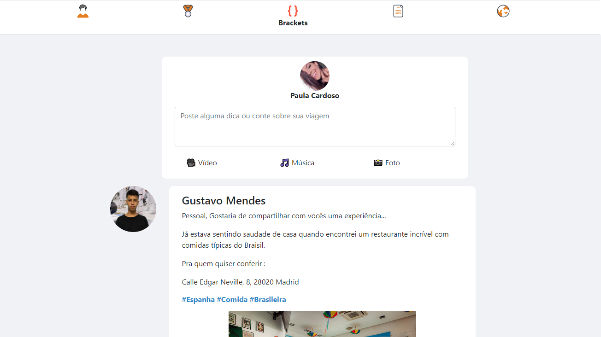
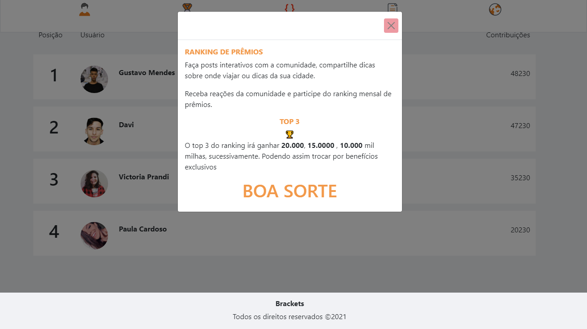

<h1 align="center">
  
</h1>

<h1 align="center">
    Hackathon Smiles
</h1>

---

Essa aplicação pode ser vista em <a href="https://brackets-smiles.vercel.app/">Brackets</a>

---

## Brackets

Com o objetivo de criar um programa de fidelidade para que a viagem dos sonhos seja mais acessível, inclusivo e democrático,  
A <strong>Brackets</strong> vem com uma proposta de ajudar voçê a ter a sua viagem dos sonhos.

- Plano de viagem completo;
- Network com a comunidade;
- Perfil com histórico;
- Ranking de Influencers;

---

<h1 align="center" >
  
</h1>

Faça Network e tira dúvidas com quem já viajou

<h1 align="center" >
      
</h1>

Seja ativo na plataforma e concorra a prêmios incriveis

<h1 align="center">
      
</h1>

## Contribuidores

<table>
  <tr>
    <td align="center">
      <a href="https://github.com/Gustavo-Developer">
         
        
          <b>Gustavo Mendes</b>
        
      </a>
    </td>
    <td align="center">
      <a href="https://github.com/DaviESilva">
         
        
          <b>Davi Evangelista</b>
        
      </a> 
    </td>

  </tr>
</table>

## References

<a href="https://storyset.com">Illustration by Freepik Storyset</a>
<a href="https://icons8.com"> icon by Icons8</a>
